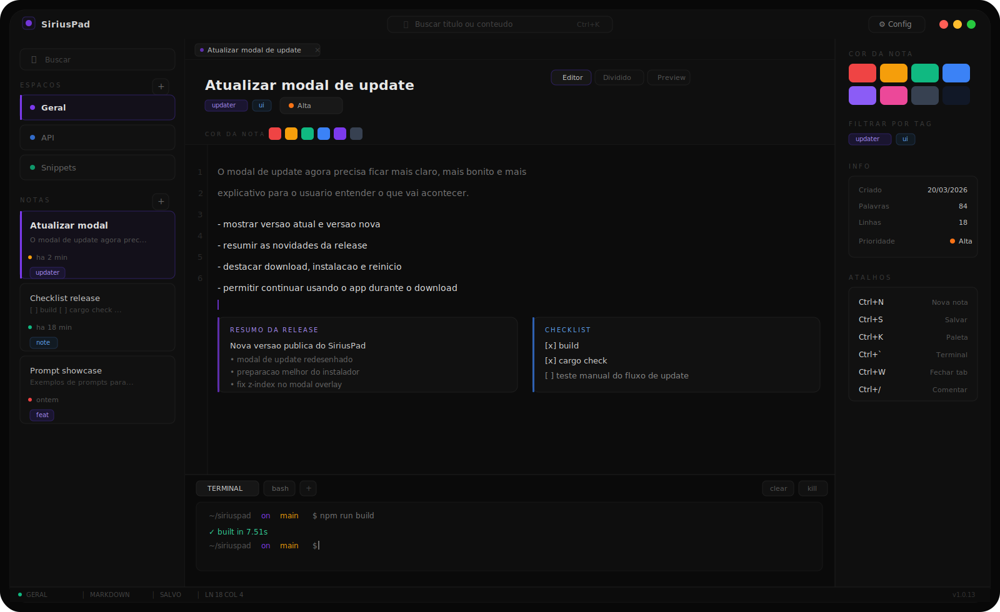

[](./LICENSE)
<!-- ALL-CONTRIBUTORS-BADGE:START - Do not remove or modify this section -->
[](#contributors-)
<!-- ALL-CONTRIBUTORS-BADGE:END -->
[](https://github.com/SiriusXofc/siriuspad/releases/latest)
[](https://github.com/SiriusXofc/siriuspad/issues)
[](https://github.com/SiriusXofc/siriuspad/stargazers)

# SiriusPad

Bloco de notas local para desenvolvedores. Rápido, escuro e feito para anotações técnicas do dia a dia, agora com beta inicial para Android.

Projeto público mantido por **SiriusX**.



## Visão geral

O **SiriusPad** é um app open source que nasceu mais por diversão, curiosidade e vontade de construir algo útil, mesmo sendo algo simples.

Ele não tenta substituir tudo, não quer reinventar a forma de fazer anotações e nem competir com editores grandes, Notion ou coisas do tipo. A proposta é bem mais humilde: ser um cantinho prático para guardar comandos, snippets, bugs, ideias, checklists e qualquer anotação técnica que aparece no meio do uso.

Sim, dá para usar bloco de notas, VS Code, Discord salvo, arquivo solto ou qualquer outra coisa. A ideia aqui não é "você precisa disso", e sim "talvez isso deixe o processo um pouco mais confortável para alguém". Se ajudar alguém, ótimo. Se não ajudar, tudo bem também.

As notas ficam no seu computador como arquivos Markdown. O uso principal do app é local, sem conta e sem obrigar sincronização externa.

## O que o app entrega hoje

- editor Markdown com CodeMirror 6
- workspaces para separar contexto por projeto, cliente ou tema
- tags, prioridade, cor da nota visível e notas fixadas
- checklist nativo por nota
- callout blocks no preview com sintaxe estilo `> [!TIP]`
- terminal embutido ligado à pasta da nota ativa
- preview de Markdown e split view
- histórico de versões por nota
- busca fuzzy em títulos e conteúdo
- autosave automático no disco
- exportação para GitHub Gist, `.md`, `.txt` e `.json`
- paleta de comandos com `Ctrl+K`
- atalhos de zoom da interface com `Ctrl++`, `Ctrl+-` e `Ctrl+0`

## Privacidade e segurança

- As notas ficam salvas localmente no seu disco.
- O terminal e o runner executam comandos na sua máquina. Revise antes de rodar.
- O token do GitHub para Gist é armazenado localmente e só é usado quando você aciona a integração.
- Releases oficiais são publicadas no GitHub do projeto.
- Vulnerabilidades devem ser reportadas em privado. Leia [SECURITY.md](./SECURITY.md).

## Distribuição oficial

Formatos suportados atualmente:

- Linux: `.deb`
- Windows: `.exe`
- Android beta: `.apk`

Os assets técnicos de updater, como `latest.json`, continuam existindo apenas para o fluxo de atualização automática.

Releases: https://github.com/SiriusXofc/siriuspad/releases/latest

## Instalação rápida

Linux:

```bash
bash <(curl -fsSL https://github.com/SiriusXofc/siriuspad/raw/main/scripts/install-linux.sh) --deb
```

Windows PowerShell:

```powershell
powershell -ExecutionPolicy Bypass -File scripts/install-windows.ps1
```

## Dependências de instalação

- Linux `.deb`: o pacote Debian gerado pelo Tauri já declara `libwebkit2gtk-4.1-0` e `libgtk-3-0` como dependências base. O script de instalação usa `apt install` no arquivo `.deb`, então essas dependências são resolvidas automaticamente no sistema.
- Windows `.exe`: o instalador NSIS do SiriusPad agora embute o bootstrapper do WebView2. Se a máquina ainda não tiver o runtime necessário, o instalador tenta preparar isso automaticamente durante a instalação.

Referências oficiais do Tauri:

- Debian: https://v2.tauri.app/distribute/debian/
- Windows Installer / WebView2: https://v2.tauri.app/distribute/windows-installer/

## Atalhos principais

| Atalho       | Ação                        |
| ------------ | --------------------------- |
| `Ctrl+N`     | Nova nota                   |
| `Ctrl+K`     | Paleta de comandos          |
| `Ctrl+F`     | Focar busca                 |
| `Ctrl+S`     | Salvar                      |
| `Ctrl+Enter` | Executar snippet            |
| `Ctrl+\``    | Alternar terminal           |
| `Ctrl++`     | Aumentar zoom da interface  |
| `Ctrl+-`     | Diminuir zoom da interface  |
| `Ctrl+0`     | Restaurar zoom da interface |
| `Ctrl+,`     | Abrir configurações         |

## Projeto público

Se você usa o SiriusPad e quer contribuir, estes arquivos são o melhor ponto de entrada:

- [CONTRIBUTING.md](./CONTRIBUTING.md)
- [SECURITY.md](./SECURITY.md)
- [CODE_OF_CONDUCT.md](./CODE_OF_CONDUCT.md)
- [NOTICE.md](./NOTICE.md)
- [CHANGELOG.md](./CHANGELOG.md)

## Compilar do fonte

Requisitos:

- Node.js 20+
- Rust stable
- Linux: `libwebkit2gtk-4.1-dev libappindicator3-dev librsvg2-dev patchelf`

```bash
git clone https://github.com/SiriusXofc/siriuspad
cd siriuspad
npm install
npm run tauri:dev
```

## Suporte e reporte

- bugs: https://github.com/SiriusXofc/siriuspad/issues
- sugestões: use as issues do repositório
- vulnerabilidades: https://github.com/SiriusXofc/siriuspad/security/advisories/new

## Licença

MIT — veja [LICENSE](./LICENSE)

## Contributors ✨

Thanks goes to these wonderful people ([emoji key](https://allcontributors.org/docs/en/emoji-key)):

<!-- ALL-CONTRIBUTORS-LIST:START - Do not remove or modify this section -->
<!-- prettier-ignore-start -->
<!-- markdownlint-disable -->
<table>
  <tbody>
    <tr>
      <td align="center" valign="top" width="14.28%"><a href="https://github.com/mrsyntaxdev"><br /><sub><b>Mr. Syntax</b></sub></a><br /><a href="https://github.com/SiriusXofc/siriuspad/commits?author=mrsyntaxdev" title="Code">💻</a></td>
    </tr>
  </tbody>
</table>

<!-- markdownlint-restore -->
<!-- prettier-ignore-end -->

<!-- ALL-CONTRIBUTORS-LIST:END -->

This project follows the [all-contributors](https://github.com/all-contributors/all-contributors) specification. Contributions of any kind welcome!